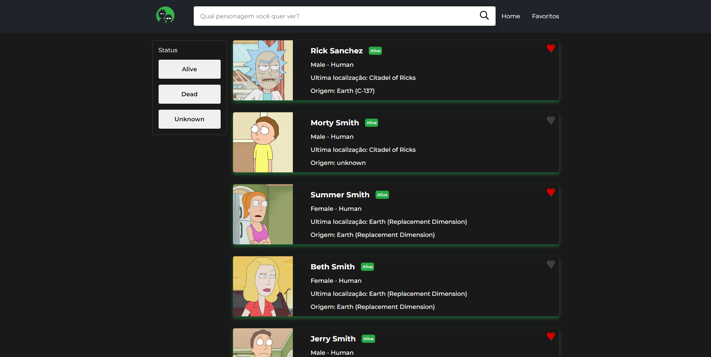

<h1 align="center">Ricky and Morty 🥒</h1>

<p align="center">
    
</p>

<h1 align="center" >
  <a href="https://api-rick-and-morty-next-js.vercel.app">Demonstração</a>
</p>

---

## 📖 Sobre

Trata-se de um catálogo de personagens do desenho Ricky and Morty desenvolvido em Next.js e TypeScript, utilizando dados da [The Ricky and Morty API](https://rickandmortyapi.com). Para estilização foi escolhida a abordagem com Styled-components.

O projeto pode ser visualizado clicando [aqui](https://api-rick-and-morty-next-js.vercel.app).


---

## 🔧 Como executar o projeto

```bash
# Clone o repositório
git clone https://github.com/GeraldoNeto123/api-rick-and-morty-nextjs.git

# Entre no diretório
cd api-rick-and-morty-nextjs

# Baixe as dependências
yarn

# Execute o projeto
yarn dev

```

---
